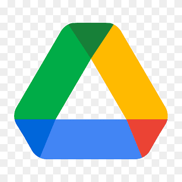

# Create HTML page from gdoc

 While Google Docs offers a built-in "Publish to Web" feature, it doesn't support tab navigation in the published output and doesn't allow custom CSS styling. This tool bridges that gap by providing a complete conversion solution with full control over the output.

This web application converts Google Docs documents with tabs and nested tabs into responsive HTML websites with an interactive navigation system. The document's tab structure is transformed into a sidebar menu on desktop or a dropdown menu on mobile, allowing easy navigation between sections.

  
  
  
  

## ✨ Features

  

    <h3 style="color: #ff9800;">📦 Distribution Options</h3>
    <ul>
      <li>Online viewing of the generated site</li>
      <li>Download the complete site as a ZIP archive</li>
      <li>Easy to deploy on any web hosting</li>
    </ul>
  

  

  <h3 style="color: #f4b400;">
     Google Drive Integration
  </h3>
    <ul>
      <li>Authenticate with Google APIs</li>
      <li>Access your documents directly</li>
      <li>Choose documents via URL or integrated Google Picker</li>
    </ul>
  

  

    <h3 style="color: #34a853;">📝 Rich Content Conversion</h3>
    <ul>
      <li>Headings, paragraphs, and text formatting</li>
      <li>Lists (ordered and unordered) with proper nesting</li>
      <li>Tables with formatting</li>
      <li>Images with original dimensions</li>
      <li>Richlinks to Google Drive files with appropriate icons</li>
      <li>Table of contents</li>
    </ul>
  

  
  

    <h3 style="color: #ea4335;">📱 Responsive Design</h3>
    <ul>
      <li>Mobile-friendly output</li>
      <li>Adaptive navigation</li>
      <li>Tab navigation transforms based on screen size</li>
    </ul>
  

## 🛠️ Requirements

- Web server with PHP support (e.g., Apache)
- Google API credentials (Client ID and API Key)
- Write permissions on the output directory

## 📦 Installation

1. Clone or download this repository to your web server's public directory
2. Ensure the `output` directory exists and has write permissions
3. Access the administration page (`admin.html`) to configure your Google API credentials:
   - Default admin password is "admin"
   - Follow the instructions to obtain Google API credentials from the [Google Cloud Console](https://console.cloud.google.com/)
   - Enable the Google Drive API and Google Docs API
   - Create OAuth credentials (Web application type)
   - Configure authorized JavaScript origins with your domain name (e.g., `https://yourdomain.com`)
   - No need to configure redirect URIs as the application runs entirely client-side
   - Create an API Key and properly restrict it
   - Save these credentials in the admin interface

## 🚀 Usage

<ol>
  <li>Open the application in your web browser</li>
  <li>Authentication with Google happens when you click the "Pick a file from Google Drive" button</li>
  <li>Enter a Google Doc URL directly or use the picker to select a document</li>
  <li>Click "Convert Google Doc to HTML" to process the document</li>
  <li>A loading animation indicates the conversion is in progress</li>
  <li>Once the conversion is complete, you have two options:
    <ul>
      <li>Click "View Generated Site" to open the site in a new tab</li>
      <li>Click "Download as ZIP" to download the complete site as an archive</li>
    </ul>
  </li>
  <li>Navigate through the document sections using the generated tab menu</li>
</ol>

## 📂 File Structure

<tr>
  <td style="padding: 8px; border: 1px solid #dadce0;"><code>admin.html</code></td>
  <td style="padding: 8px; border: 1px solid #dadce0;">Administration interface for managing API credentials</td>
</tr>
<tr style="background-color: #f5f7fa;">
  <td style="padding: 8px; border: 1px solid #dadce0;"><code>get_config.php</code></td>
  <td style="padding: 8px; border: 1px solid #dadce0;">Script to retrieve API configuration</td>
</tr>
<tr>
  <td style="padding: 8px; border: 1px solid #dadce0;"><code>save_config.php</code></td>
  <td style="padding: 8px; border: 1px solid #dadce0;">Script to save API configuration</td>
</tr>
<tr style="background-color: #f5f7fa;">
  <td style="padding: 8px; border: 1px solid #dadce0;"><code>assets/credentials.json</code></td>
  <td style="padding: 8px; border: 1px solid #dadce0;">File storing API credentials (protected from direct access)</td>
</tr>

## ⚙️ How It Works

<strong>Client-Side Processing:</strong> All Google Doc parsing and HTML generation code runs entirely in the client's browser. This approach ensures your document content remains private between your browser and Google's servers, with no intermediate storage on our server.

  
1

  
The application loads API credentials from the server configuration and authenticates with Google APIs using OAuth 2.0

  
  

    
2

    
It fetches the selected document's content via the Google Docs API

  

  
  

    
3

    
The document's tab structure is analyzed and converted to a navigation hierarchy

  

  
  

    
4

    
The document structure is parsed, including headings, lists, tables, and embedded objects

  

  
  

    
5

    
Images and other embedded content are downloaded and converted for local use

  

  
  

    
6

    
A responsive HTML site is generated with CSS styling and JavaScript for tab navigation

  

  
  

    
7

    
The site files are saved to the output directory with a folder name based on the document title

  

## 🎨 Customization

 
  <h4 style="color: #4285f4;">Default Styling</h4>
  
Modify the default CSS styling for all generated sites by editing the <code>styles.css</code> file

  
  <h4 style="color: #4285f4;">Per-Site Styling</h4>
  
Each generated site contains its own copy of the CSS file that can be customized individually

## ⚠️ Troubleshooting

  <h4 style="color: #ea4335; margin-top: 0;">Authentication Issues</h4>
  
Ensure your Google API credentials are correct and have the necessary permissions

  
Make sure  "Authorized JavaScript origins" is properly configured in your Google Cloud Console

  
  <h4 style="color: #ea4335;">Authentication Error on Production Server</h4>
  
If you receive "Failed to open popup window" errors, check that your domain is added to the JavaScript origins URIs in the OAuth client settings

  
  <h4 style="color: #ea4335;">Administration Access</h4>
  
If you've lost your admin password, delete the credentials.json file in the assets directory and access admin.html again to reset with the default password "admin"

   
  <h4 style="color: #ea4335;">Write Permission Errors</h4>
  
Verify that the web server has write permissions to the output directory

  
  <h4 style="color: #ea4335;">ZIP Download Issues</h4>
  
Ensure the tmp directory exists and has proper write permissions

## 📄 License

This project is licensed under the MIT License - see the [LICENSE](LICENSE) file for details.

## 👏 Credits

- Uses Google Drive API and Google Docs API
- Icons provided by Material Design

  
Made with ❤️ for Google Docs users

